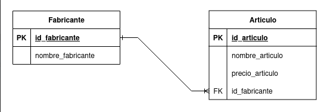
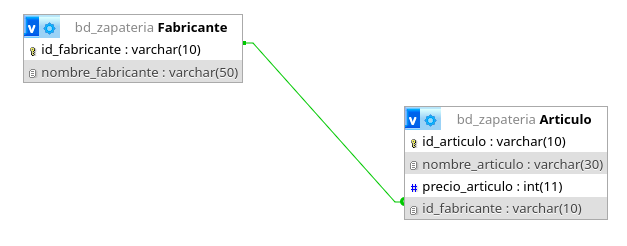
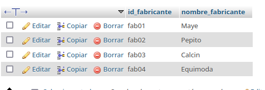
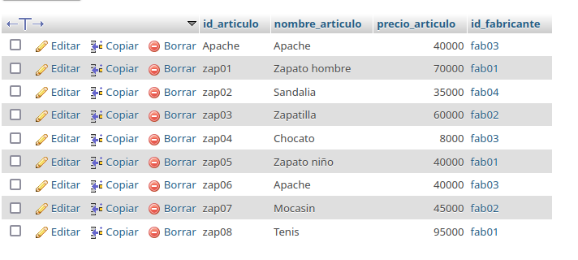
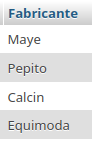
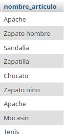
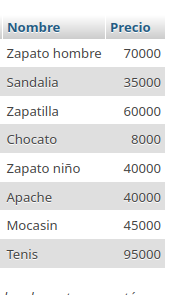
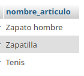
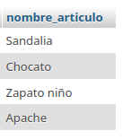

# Sistema para una zapateria

## Modelo Entidad-Relacion

## Modelo fisico de la BD

## Tabla fabricante

## Tabla Articulo

## Consultas a la BD

1. Mostrar la lista de todos los datos de los fabricantes 

`SELECT * FROM Fabricante;`

2. Mostrar la lista de los Fabricantes, poniendo un alias al nombre de la colomna

`SELECT nombre_fabricante AS Fabricante FROM Fabricante`

3. Mostrar los nombres de los productos.

`SELECT nombre_articulo FROM Articulo`

4. Obtener los nombres y los precios de los productos de la tienda.

`SELECT nombre_articulo AS Nombre, precio articulo AS Precio FROM Articulo`

5. Obtener los nombres de los articulos cuyo precio sea superior a los 50000

`SELECT nombre_articulo FROM Articulo WHERE precio_articulo > 50000;`

6. Obtener el nombre de los articulos cuyo precio este entre 50000 y 40000 (ambos incluidos)

### Forma 1
`SELECT nombre_articulo FROM Articulo WHERE precio_articulo >= 5000 AND precio_articulo <= 40000;`

### Forma 2 
`SELECT nombre_articulo FROM Articulo WHERE precio_articulo BETWEEN 5000 AD 40000`

7. Obtener el nombre y el precio en dolares de todos los articulos 

8. Calcular el precio promedio de  todos los articulos

9. Obtener el precio promedio de los articulos cuyo id del fabricante sea fab02

10. Obtener el numero de articulos cuyo precio sea mayor igual a 50000
